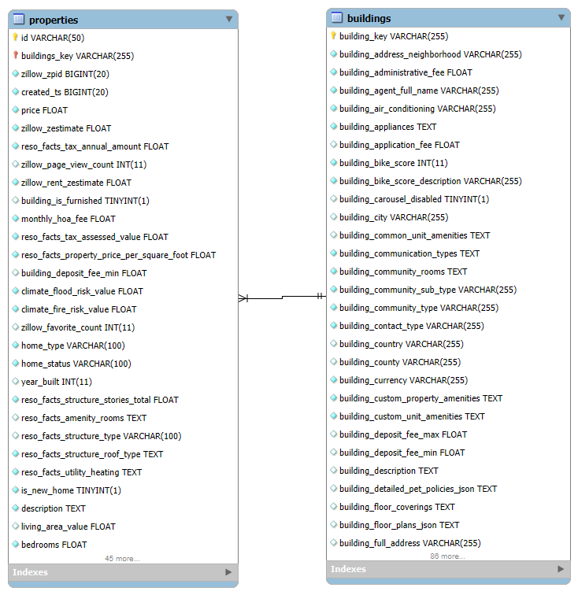
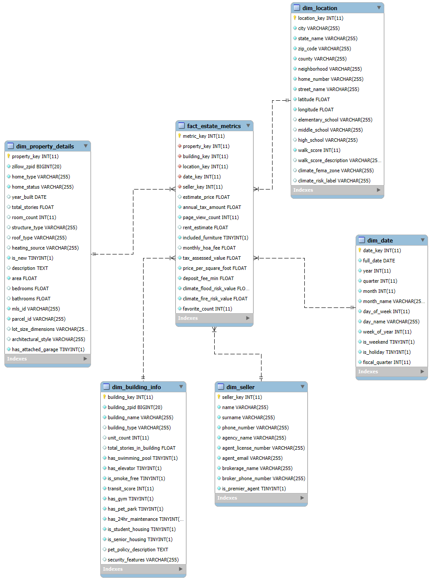
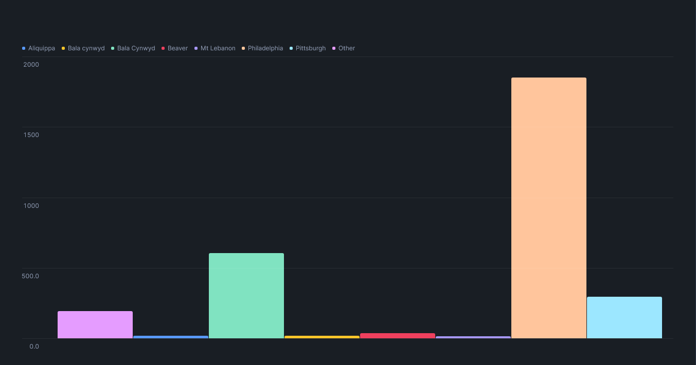
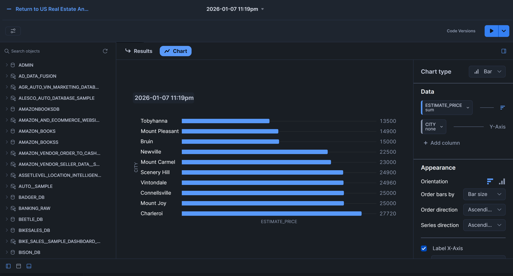
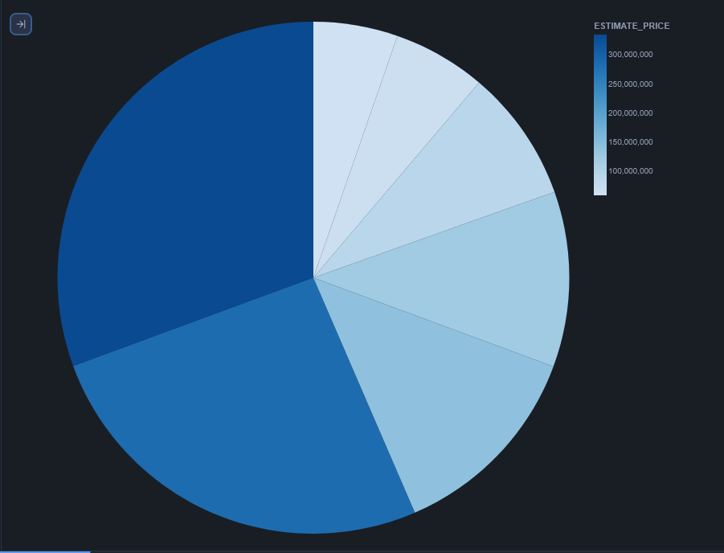

# ELT proces datasetu US Real Estate (Pennsylvania)

Tento repozitár predstavuje implementáciu ELT procesu v Snowflake na analýzu realitného trhu v štáte Pensylvánia (USA). Projekt sa zameriava na transformáciu surových dát z marketplace do hviezdicovej schémy (Star Schema), čo umožňuje efektívnu multidimenzionálnu analýzu kľúčových metrík trhu nehnuteľností.

Výsledný model umožňuje investorom a analytikom preskúmať vzťahy medzi cenou, lokalitou, občianskou vybavenosťou a klimatickými rizikami.

---

## 1. Úvod a popis zdrojových dát

Cieľom projektu je analyzovať trh s nehnuteľnosťami v mestách ako **Philadelphia, Pittsburgh a Scranton**. Analýza sa zameriava na hodnotenie investičných príležitostí, vplyv infraštruktúry na cenu a posúdenie klimatických rizík.

Zdrojové dáta pochádzajú z datasetu **US Real Estate Properties** od poskytovateľa **Elementix**, dostupného cez Snowflake Marketplace. Dáta sú v staging vrstve uložené v dvoch rozsiahlych tabuľkách, ktoré obsahujú komplexné technické, finančné a geografické atribúty:

### 1.1 Detailný popis staging tabuliek

#### A. Tabuľka `buildings` (Metadata budov a infraštruktúra)
Táto tabuľka slúži ako číselník objektov a komplexov, v ktorých sa nehnuteľnosti nachádzajú. Obsahuje 115 stĺpcov zameraných na širší kontext budovy.
* **Identifikátory:** `building_key` (PK), `building_zpid` (identifikátor Zillow).
* **Lokalita a normalizácia adries:** Obsahuje surové aj normalizované adresné údaje (`normalized_city`, `normalized_state_name`, `normalized_zip_code`), čo zabezpečuje vysokú presnosť pri geografickom mapovaní.
* **Občianska vybavenosť (Amenities):** Detailné informácie o spoločných priestoroch a vybavení (bazén, posilňovňa, výťah, 24-hodinová údržba, park pre domáce zvieratá).
* **Indexy mobility:** `building_walk_score`, `building_transit_score` a `building_bike_score`, ktoré definujú kvalitu lokality z pohľadu dopravy a dostupnosti.
* **Pravidlá a poplatky:** Informácie o depozitoch, poplatkoch za prihlášku (`application_fee`) a podrobných pravidlách pre zvieratá (`pet_policy_description`).

#### B. Tabuľka `properties` (Detaily ponúk a finančné metriky)
Táto tabuľka predstavuje jadro analýzy, nakoľko obsahuje konkrétne ponuky nehnuteľností, ich fyzický stav a finančnú históriu. Obsahuje 73 stĺpcov.
* **Finančné ukazovatele:** Aktuálna cena (`price`), trhový odhad (`zillow_zestimate`), ročné dane (`reso_facts_tax_annual_amount`), mesačné poplatky.
* **Fyzické charakteristiky:** Počet spální (`bedrooms`), kúpeľní, rok výstavby (`year_built`), rozloha obytnej plochy (`living_area_value`) a architektonický štýl.
* **Environmentálne a klimatické riziká:** Indexy povodňového (`flood_risk_value`) a požiarneho rizika vrátane klasifikácie FEMA zón.
* **Marketingové dáta:** Popularita ponuky vyjadrená cez `zillow_page_view_count` a `zillow_favorite_count`.
* **Vzdelanie:** Dáta o priradených školských obvodoch (základné, stredné a vysoké školy).
* **Informácie o predajcoch:** Údaje o agentoch a brokerských spoločnostiach (`brokerage_name`, `attribution_agent_license_number`).

### 1.2 Dátová architektúra

#### ERD diagram
Surové dáta sú v staging vrstve prepojené prostredníctvom identifikátora **building_key**, kde jedna budova (`buildings`) môže obsahovať viacero konkrétnych nehnuteľností/jednotiek (`properties`).




*Obrázok 1 Entitno-relačná schéma zdrojových dát (Staging layer)*

---

## 2. Dimenzionálny model

V projekte bola navrhnutá **schéma hviezdy (star schema)** podľa Kimballovej metodológie. Táto štruktúra obsahuje jednu tabuľku faktov **`fact_estate_metrics`**, ktorá je prepojená so patmi dimenziami:

* **`dim_property_details`**: Obsahuje podrobné fyzické informácie o nehnuteľnosti (typ stavby, počet izieb, rozloha, materiál).
* **`dim_building_info`**: Zahŕňa údaje o budove ako celku (počet jednotiek, vybavenie ako posilňovňa či bazén, bezpečnostné prvky).
* **`dim_location`**: Obsahuje geografické dáta vrátane informácií o školských obvodoch a indexoch dostupnosti (Walk Score).
* **`dim_seller`**: Údaje o agentoch, ich licenciách a pridružených brokerských spoločnostiach.
* **`dim_date`**: Podrobná časová dimenzia pre analýzu trendov (deň, mesiac, štvrťrok, víkendy).
  
Štruktúra hviezdicového modelu je znázornená na diagrame nižšie:


*Obrázok 2 Schéma hviezdy pre US Real Estate Analytics*

---

## 3. ELT proces v Snowflake

ELT proces pozostáva z troch hlavných fáz: extrahovanie (Extract), načítanie (Load) a transformácia (Transform).

### 3.1 Extract (Extrahovanie dát)
Dáta zo zdrojového datasetu boli najprv sprístupnené v Snowflake prostredníctvom Marketplace. Pre import súborov tretích strán bolo vytvorené interné stage úložisko:


```sql
-- Створення бази даних та схеми
CREATE DATABASE IF NOT EXISTS LION_MY_LAST_PROJECT;
CREATE SCHEMA IF NOT EXISTS LION_MY_LAST_PROJECT.STAGING;

-- Створення staging таблиці
CREATE OR REPLACE TABLE LION_MY_LAST_PROJECT.STAGING.STAGING_REAL_ESTATE_FULL AS
SELECT DISTINCT
    -- ІДЕНТИФІКАТОРИ
    p.ZILLOW_ZPID AS property_zpid,
    p.ID AS property_internal_id,
    p.BUILDING_KEY,
    b.BUILDING_ZPID AS building_zpid,
    
    -- МЕТРИКИ
    p.PRICE AS estimate_price,
    p.RESO_FACTS_TAX_ANNUAL_AMOUNT AS annual_tax_amount,
    p.ZILLOW_PAGE_VIEW_COUNT AS page_view_count,
    p.ZILLOW_RENT_ZESTIMATE AS rent_estimate,
    b.BUILDING_IS_FURNISHED AS included_furniture,
    p.MONTHLY_HOA_FEE,
    p.RESO_FACTS_TAX_ASSESSED_VALUE AS tax_assessed_value,
    p.RESO_FACTS_PROPERTY_PRICE_PER_SQUARE_FOOT AS price_per_square_foot,
    b.BUILDING_DEPOSIT_FEE_MIN AS deposit_fee_min,
    p.climate_climate_flood_risk_value as climate_flood_risk_value,
    p.climate_CLIMATE_FIRE_RISK_VALUE as climate_fire_risk_value,
    p.ZILLOW_FAVORITE_COUNT AS favorite_count,

    -- ДЕТАЛІ КВАРТИРИ
    p.HOME_TYPE,
    p.HOME_STATUS,
    p.YEAR_BUILT,
    p.RESO_FACTS_STRUCTURE_STORIES_TOTAL AS total_stories_property,
    p.RESO_FACTS_AMENITY_ROOMS AS room_count_raw,
    p.RESO_FACTS_STRUCTURE_TYPE AS structure_type,
    p.RESO_FACTS_STRUCTURE_ROOF_TYPE AS roof_type,
    p.RESO_FACTS_UTILITY_HEATING AS heating_source,
    p.IS_NEW_HOME AS is_new,
    p.DESCRIPTION AS property_description,
    p.LIVING_AREA_VALUE AS area,
    p.BEDROOMS,
    p.BATHROOMS,
    p.MLSID AS mls_id,
    p.PARCEL_ID,
    p.RESO_FACTS_PROPERTY_LOT_SIZE_DIMENSIONS AS lot_size_dimensions,
    p.RESO_FACTS_STRUCTURE_ARCHITECTURAL_STYLE AS architectural_style,
    p.RESO_FACTS_STRUCTURE_HAS_ATTACHED_GARAGE AS has_attached_garage,

    -- БУДІВЛЯ
    b.BUILDING_NAME,
    b.BUILDING_TYPE,
    b.BUILDING_UNIT_COUNT AS unit_count,
    b.BUILDING_HAS_SWIMMING_POOL AS has_swimming_pool,
    b.BUILDING_HAS_ELEVATOR AS has_elevator,
    b.BUILDING_IS_SMOKE_FREE AS is_smoke_free,
    b.BUILDING_TRANSIT_SCORE AS transit_score,
    b.BUILDING_HAS_PET_PARK AS has_pet_park, 
    b.BUILDING_HAS_24HR_MAINTENANCE AS has_24hr_maintenance,
    b.BUILDING_IS_STUDENT_HOUSING AS is_student_housing,
    b.BUILDING_IS_SENIOR_HOUSING AS is_senior_housing,
    b.BUILDING_PET_POLICY_DESCRIPTION AS pet_policy_description,
    b.BUILDING_SECURITY_TYPES AS security_features,

    -- ЛОКАЦІЯ
    p.PROPERTY_CITY AS city,
    p.PROPERTY_STATE AS state_name,
    p.PROPERTY_ZIPCODE AS zip_code,
    p.COUNTY,
    p.PROPERTY_NEIGHBORHOOD AS neighborhood,
    p.NORMALIZED_ADDRESS_NUMBER AS home_number,
    p.NORMALIZED_STREET_NAME AS street_name,
    p.LATITUDE,
    p.LONGITUDE,
    p.RESO_FACTS_PROPERTY_ELEMENTARY_SCHOOL AS elementary_school,
    p.RESO_FACTS_PROPERTY_MIDDLE_SCHOOL AS middle_school,
    p.RESO_FACTS_PROPERTY_HIGH_SCHOOL AS high_school,
    b.BUILDING_WALK_SCORE AS walk_score,
    b.BUILDING_WALK_SCORE_DESCRIPTION AS walk_score_description,
    p.climate_CLIMATE_FEMA_ZONE as climate_fema_zone,
    p.climate_CLIMATE_FLOOD_RISK_LABEL AS climate_risk_label,

    -- ДАТА
    p.CREATED_TS, 
    p.DATE_POSTED_STRING,

    -- ПРОДАВЕЦЬ
    p.ATTRIBUTION_AGENT_NAME AS seller_name,
    p.ATTRIBUTION_AGENT_PHONE_NUMBER AS seller_phone,
    p.ATTRIBUTION_BROKER_NAME AS agency_name,
    p.ATTRIBUTION_AGENT_LICENSE_NUMBER AS agent_license,
    p.ATTRIBUTION_AGENT_EMAIL AS agent_email,
    p.BROKERAGE_NAME,
    p.ATTRIBUTION_BROKER_PHONE_NUMBER AS broker_phone,
    p.ZILLOW_IS_PREMIER_BUILDER AS is_premier_agent

FROM LION_DB_PROJECT_F.PUBLIC.PROPERTIES p
LEFT JOIN LION_DB_PROJECT_F.PUBLIC.BUILDINGS b 
    ON p.BUILDING_KEY = b.BUILDING_KEY;
```

### 3.2 Vytvorenie tabuliek dimenzií a faktov

```sql
-- DIM_DATE
INSERT INTO DIM_DATE (date_key, full_date, year, quarter, month, month_name, day_of_week, day_name, week_of_year, is_weekend, is_holiday, fiscal_quarter)
SELECT 
    TO_NUMBER(TO_CHAR(TO_DATE(TO_TIMESTAMP(CREATED_TS / 1000000)), 'YYYYMMDD')) as date_key,
    TO_DATE(TO_TIMESTAMP(CREATED_TS / 1000000)) as full_date,
    YEAR(TO_DATE(TO_TIMESTAMP(CREATED_TS / 1000000))) as year,
    QUARTER(TO_DATE(TO_TIMESTAMP(CREATED_TS / 1000000))) as quarter,
    MONTH(TO_DATE(TO_TIMESTAMP(CREATED_TS / 1000000))) as month,
    MONTHNAME(TO_DATE(TO_TIMESTAMP(CREATED_TS / 1000000))) as month_name,
    DAYOFWEEKISO(TO_DATE(TO_TIMESTAMP(CREATED_TS / 1000000))) as day_of_week,
    DAYNAME(TO_DATE(TO_TIMESTAMP(CREATED_TS / 1000000))) as day_name,
    WEEKISO(TO_DATE(TO_TIMESTAMP(CREATED_TS / 1000000))) as week_of_year,
    IFF(DAYOFWEEKISO(TO_DATE(TO_TIMESTAMP(CREATED_TS / 1000000))) IN (6, 7), TRUE, FALSE) as is_weekend,
    FALSE as is_holiday,
    CASE 
        WHEN QUARTER(TO_DATE(TO_TIMESTAMP(CREATED_TS / 1000000))) = 1 THEN 1 
        ELSE QUARTER(TO_DATE(TO_TIMESTAMP(CREATED_TS / 1000000))) 
    END as fiscal_quarter
FROM LION_MY_LAST_PROJECT.STAGING.STAGING_REAL_ESTATE_FULL
WHERE CREATED_TS IS NOT NULL;

-- DIM_LOCATION
INSERT INTO DIM_LOCATION (city, state_name, zip_code, county, neighborhood, home_number, street_name, latitude, longitude, elementary_school, middle_school, high_school, walk_score, walk_score_description, climate_fema_zone, climate_risk_label)
SELECT 
    city, state_name, zip_code, county, neighborhood, home_number, street_name,
    latitude, longitude, elementary_school, middle_school, high_school,
    walk_score, walk_score_description, climate_fema_zone, climate_risk_label
FROM LION_MY_LAST_PROJECT.STAGING.STAGING_REAL_ESTATE_FULL;

-- DIM_BUILDING_INFO
INSERT INTO DIM_BUILDING_INFO (building_zpid, building_name, building_type, unit_count, total_stories_in_building, has_swimming_pool, has_elevator, is_smoke_free, transit_score, has_gym, has_pet_park, has_24hr_maintenance, is_student_housing, is_senior_housing, pet_policy_description, security_features)
SELECT 
    building_zpid, building_name, building_type, unit_count,
    NULL as total_stories_in_building, 
    has_swimming_pool, has_elevator, is_smoke_free, transit_score,
    FALSE as has_gym, has_pet_park, has_24hr_maintenance,
    is_student_housing, is_senior_housing, pet_policy_description, security_features
FROM LION_MY_LAST_PROJECT.STAGING.STAGING_REAL_ESTATE_FULL;

-- DIM_SELLER
INSERT INTO DIM_SELLER (name, surname, phone_number, agency_name, agent_license_number, agent_email, brokerage_name, broker_phone_number, is_premier_agent)
SELECT 
    seller_name,
    SPLIT_PART(seller_name, ' ', -1) as surname,
    seller_phone, agency_name, agent_license, agent_email,
    brokerage_name, broker_phone, is_premier_agent
FROM LION_MY_LAST_PROJECT.STAGING.STAGING_REAL_ESTATE_FULL;

-- DIM_PROPERTY_DETAILS
INSERT INTO DIM_PROPERTY_DETAILS (zillow_zpid, home_type, home_status, year_built, total_stories, room_count, structure_type, roof_type, heating_source, is_new, description, area, bedrooms, bathrooms, mls_id, parcel_id, lot_size_dimensions, architectural_style, has_attached_garage)
SELECT 
    property_zpid, home_type, home_status,
    TO_DATE(TO_VARCHAR(year_built), 'YYYY') as year_built,
    total_stories_property,
    REGEXP_COUNT(room_count_raw, 'roomType') as room_count,
    structure_type, roof_type, heating_source, is_new, property_description,
    area, bedrooms, bathrooms, mls_id, parcel_id, lot_size_dimensions,
    architectural_style, has_attached_garage
FROM LION_MY_LAST_PROJECT.STAGING.STAGING_REAL_ESTATE_FULL;

--FACT-ESTATE-METRICS
INSERT INTO FACT_ESTATE_METRICS (property_key, building_key, date_key, estimate_price, annual_tax_amount, page_view_count, rent_estimate, included_furniture, monthly_hoa_fee, tax_assessed_value,price_per_square_foot, deposit_fee_min, climate_flood_risk_value, 
climate_fire_risk_value, favorite_count
)
SELECT 
    dp.property_key,
    db.building_key,
    dd.date_key,
    stg.estimate_price,
    stg.annual_tax_amount,
    stg.page_view_count,
    stg.rent_estimate,
    stg.included_furniture,
    stg.monthly_hoa_fee,
    stg.tax_assessed_value,
    stg.price_per_square_foot,
    stg.deposit_fee_min,
    stg.climate_flood_risk_value,
    stg.climate_fire_risk_value,
    stg.favorite_count

FROM LION_MY_LAST_PROJECT.STAGING.STAGING_REAL_ESTATE_FULL stg

JOIN DIM_PROPERTY_DETAILS dp ON stg.property_zpid = dp.zillow_zpid

JOIN DIM_DATE dd ON dd.date_key = TO_NUMBER(TO_CHAR(TO_DATE(TO_TIMESTAMP(stg.CREATED_TS / 1000000)), 'YYYYMMDD'))

LEFT JOIN DIM_BUILDING_INFO db ON stg.building_zpid = db.building_zpid
```

---


## 4. Vizualizácia dát

Dashboard obsahuje **8 vizualizácií**, ktoré poskytujú komplexný pohľad na kľúčové metriky a trendy na realitnom trhu v Pensylvánii. Tieto vizualizácie odpovedajú na dôležité otázky investorov a umožňujú lepšie pochopiť vzťah medzi cenou, lokalitou a environmentálnymi rizikami.

### Graf 1: Najdrahšie nehnuteľnosti v bezpečných zónach (Nízke riziko)
Táto vizualizácia identifikuje prémiové nehnuteľnosti, ktoré sa nachádzajú v oblastiach s minimálnym rizikom povodní a požiarov (index < 2). Pomáha investorom nájsť vysoko hodnotné objekty, ktoré sú zároveň dlhodobo chránené pred klimatickými hrozbami.

```sql
SELECT 
    l.street_name, 
    l.city,
    f.climate_flood_risk_value,
    f.climate_fire_risk_value,
    f.estimate_price
FROM FACT_ESTATE_METRICS f
JOIN DIM_LOCATION l ON f.location_key = l.location_key
JOIN DIM_PROPERTY_DETAILS p ON f.property_key = p.property_key
WHERE f.climate_flood_risk_value < 2 
  AND f.climate_fire_risk_value < 2 
  AND p.home_status = 'FOR_SALE'
  and l.street_name is not null
ORDER BY f.estimate_price DESC;
```




### Graf 2: Dostupnosť rodinného bývania (Top 10 najlacnejších)
Graf zobrazuje 10 najdostupnejších nehnuteľností pre rodiny: minimálne 3 spálne a cena pod 300 000 USD. Táto analýza umožňuje sledovať možnosti pre strednú vrstvu obyvateľstva a identifikovať najvýhodnejšie ponuky na trhu.

```sql
SELECT 
    CONCAT(COALESCE(l.home_number, ''), ' ', COALESCE(l.street_name, '')) AS property_street_address,
    l.city, 
    f.estimate_price, 
    p.bedrooms, 
    p.area,
FROM FACT_ESTATE_METRICS f
JOIN DIM_LOCATION l ON f.location_key = l.location_key
JOIN DIM_PROPERTY_DETAILS p ON f.property_key = p.property_key
WHERE 
    f.estimate_price <= 300000 
    AND f.estimate_price > 0
    AND p.bedrooms >= 3
    AND p.home_status = 'FOR_SALE'

ORDER BY f.estimate_price ASC
LIMIT 10;
```




### Graf 3: Moderné trendy: Novostavby s vybavením pre zvieratá
Tento prehľad sa zameriava na moderné budovy postavené po roku 2020, ktoré reflektujú trendy ako "pet-friendly" (parky pre psov). Vizualizácia ukazuje, že nová výstavba sa čoraz viac sústredi na doplnkovú infraštruktúru.

```sql
SELECT 
    b.building_name,
    p.year_built,
    b.has_pet_park,
    f.estimate_price
FROM FACT_ESTATE_METRICS f
JOIN DIM_BUILDING_INFO b ON f.building_key = b.building_key
JOIN DIM_PROPERTY_DETAILS p ON f.property_key = p.property_key
WHERE p.year_built >= 2020
  AND b.has_pet_park = TRUE
ORDER BY p.year_built DESC, f.estimate_price;
```

### Graf 4: Analýza trhového záujmu (Populárne ale nepredané)
Vizualizácia porovnáva počet zobrazení a uložení do obľúbených pri nehnuteľnostiach, ktoré sú stále na predaj. Identifikuje objekty, ktoré generujú vysoký organický záujem, ale zostávajú na trhu dlšie.

```sql
SELECT 
    p.zillow_zpid,
    CONCAT(COALESCE(l.home_number, ''), ' ', COALESCE(l.street_name, '')) AS property_street_address,
    f.estimate_price,
    f.favorite_count,
    f.page_view_count
FROM FACT_ESTATE_METRICS f
JOIN DIM_PROPERTY_DETAILS p ON f.property_key = p.property_key
JOIN DIM_LOCATION l ON f.location_key = l.location_key
WHERE 
    p.home_status = 'FOR_SALE' 
    AND f.page_view_count IS NOT NULL
ORDER BY 
    f.favorite_count DESC, 
    f.page_view_count DESC
LIMIT 10;
```


### Graf 5: Porovnanie cien voči priemeru okresu (County)
Táto tabuľka využíva okenné funkcie na výpočet rozdielu medzi cenou konkrétneho domu a priemernou cenou v danom okrese. Umožňuje detegovať podhodnotené alebo naopak luxusné ponuky.

```sql
SELECT 
p.zillow_zpid,
    CONCAT(COALESCE(l.home_number, ''), ' ', COALESCE(l.street_name, '')) AS full_address,
        l.county, 
        f.estimate_price,
        AVG(f.estimate_price) OVER (PARTITION BY l.county) AS avg_county_price,
        f.estimate_price - AVG(f.estimate_price) OVER (PARTITION BY l.county) AS price_diff_from_avg
FROM FACT_ESTATE_METRICS f
JOIN DIM_LOCATION l ON f.location_key = l.location_key
JOIN DIM_PROPERTY_DETAILS p ON f.property_key = p.property_key
WHERE 
    f.estimate_price IS NOT NULL 
    AND l.county IS NOT NULL
    AND f.estimate_price > 0
ORDER BY price_diff_from_avg desc
LIMIT 100;
```




### Graf 6: Identifikácia podhodnotených investičných príležitostí
Vizualizácia porovnáva ponukovú cenu s trhovým odhadom (Zestimate). Cieľom je nájsť nehnuteľnosti predávané pod hodnotou, čo pre investora predstavuje okamžitý potenciálny zisk.

```sql
SELECT 
    l.city,
    f.estimate_price AS current_price,
    f.rent_estimate AS market_value, 
    (f.rent_estimate - f.estimate_price) AS potential_profit
FROM FACT_ESTATE_METRICS f
JOIN DIM_LOCATION l ON f.location_key = l.location_key
WHERE f.rent_estimate IS NOT NULL 
  AND f.estimate_price IS NOT NULL
  AND f.estimate_price < f.rent_estimate
  AND f.estimate_price > 0
ORDER BY potential_profit DESC
LIMIT 10;```

### Graf 7: Kumulatívna pozornosť používateľov podľa agentov
Tento graf pomocou okenných funkcií (SUM OVER) sleduje kumulatívny počet zobrazení stránok pre jednotlivých agentov. Umožňuje identifikovať najúspešnejších brokerov, ktorí generujú najväčšiu pozornosť na trhu.

```sql
SELECT 
    s.name AS seller_name, -- Виправлено на name
    s.agency_name, 
    f.page_view_count,
    SUM(f.page_view_count) OVER (
        PARTITION BY s.seller_key 
        ORDER BY f.property_key 
    ) as running_total_agent_views,
    SUM(f.page_view_count) OVER (PARTITION BY s.seller_key) as total_agent_views
FROM FACT_ESTATE_METRICS f
JOIN DIM_SELLER s ON f.seller_key = s.seller_key
WHERE f.page_view_count IS NOT NULL;
```

### Graf 8: Výkonnosť realitných kancelárií a kumulatívne predaje
Graf znázorňuje úspešnosť brokerov v roku 2025. Pomocou kumulatívnej sumy môžeme sledovať celkovú predajnú silu najväčších hráčov na trhu v Pensylvánii.

```sql
WITH CompanyStats AS (
    SELECT 
        s.agency_name AS company_name,
        COUNT(f.metric_key) AS sold_count,
        COUNT(CASE WHEN d.year = 2025 THEN 1 END) AS sold_last_year
    FROM FACT_ESTATE_METRICS f
    JOIN DIM_SELLER s ON f.seller_key = s.seller_key
    JOIN DIM_PROPERTY_DETAILS p ON f.property_key = p.property_key
    JOIN DIM_DATE d ON f.date_key = d.date_key
    WHERE p.home_status = 'SOLD'
    GROUP BY s.agency_name
)
SELECT 
    company_name,
    sold_count,
    SUM(sold_count) OVER (ORDER BY sold_count DESC) AS cumulative_total_sold
FROM CompanyStats
ORDER BY sold_last_year DESC;
```
