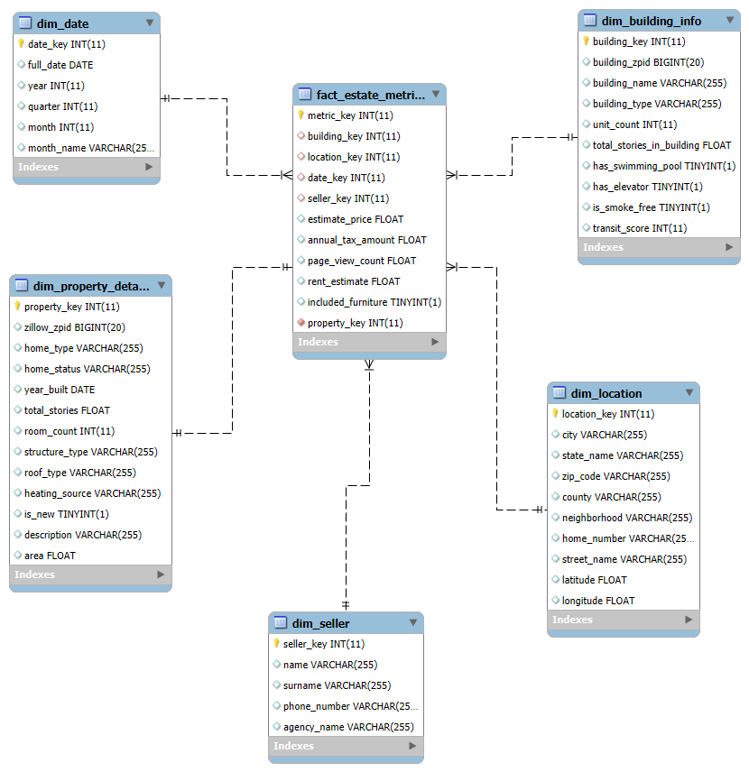

# 🏠 Analýza realitného trhu v USA (Pensylvánia)

Tento projekt sa zameriava na budovanie dátového skladu a následnú analytiku nehnuteľností v regióne Pensylvánia. Využívame moderný ELT prístup v prostredí **Snowflake** s vizualizáciou architektúry v **MySQL Workbench**.

---

## 1. Úvod a popis zdrojových dát

Cieľom projektu je analyzovať trh s nehnuteľnosťami v mestách ako **Philadelphia, Pittsburgh a Scranton**. Ako primárny zdroj údajov sme zvolili dataset **US Real Estate Properties** od poskytovateľa **Elementix**, ktorý je dostupný prostredníctvom Snowflake Marketplace.

### 🎯 Prečo sme si vybrali tento dataset?
Realitný trh ponúka ideálnu štruktúru pre demonštráciu ELT procesov. Dataset obsahuje bohatú kombináciu:
* **Finančných ukazovateľov:** Umožňujú ekonomické porovnávanie.
* **Geografických súradníc:** Umožňujú priestorovú analýzu a mapovanie.
* **Technických parametrov:** Umožňujú hĺbkovú segmentáciu nehnuteľností.

> **Podporovaný biznis proces:** > Analýza primárne podporuje proces **hodnotenia investičných príležitostí (Investment Appraisal)**. Nástroj umožňuje investorom a realitným maklérom identifikovať nehnuteľnosti, ktoré sú podhodnotené vzhľadom na ich lokalitu, občiansku vybavenosť a technický stav.

---

### 📊 Typy údajov a zameranie analýzy
Dáta sú v našom sklade spracované do nasledujúcich kategórií:

1. **Numerické metriky:** Trhová cena (`PRICE`), odhadovaná hodnota (`ZESTIMATE`), ročné dane a rozloha v štvorcových stopách.
2. **Geografické údaje:** Presné GPS súradnice (Latitude/Longitude), názvy okresov (**County**) a normalizované adresy pre presnú identifikáciu.
3. **Kategorické atribúty:** Typy vykurovania, stav nehnuteľnosti (Sold, Pending, Auction), typy striech a infraštruktúra.

**Hlavný cieľ:** Zistiť, ako lokalita (reprezentovaná indexmi mobility `Walk Score` a `Transit Score`) a technické parametre budovy (vek, počet podlaží) korelujú s trhovou cenou a daňovým zaťažením.

---

### 🗂️ Popis zdrojových tabuliek (Staging Layer)

Zdrojový dataset pozostáva z dvoch hlavných tabuliek, ktoré sme využili ako základ pre náš staging layer:

#### 🏢 BUILDINGS
* **Význam:** Predstavuje fyzické štruktúry, bytové komplexy a ich širšie okolie.
* **Kľúčové polia:** * `BUILDING_UNIT_COUNT`: Počet bytových jednotiek v objekte.
    * `BUILDING_WALK_SCORE` / `BUILDING_TRANSIT_SCORE`: Indexy dostupnosti.
    * `BUILDING_HEATING_SOURCE`: Typ energetického zdroja pre vykurovanie.
    * **Vybavenosť:** Príznaky pre bazén, výťah či nefajčiarske priestory.

#### 🏠 PROPERTIES
* **Význam:** Reprezentuje konkrétne ponuky nehnuteľností, ich technický stav a finančnú históriu.
* **Kľúčové polia:**
    * `ZILLOW_ZESTIMATE`: Algoritmický odhad trhovej ceny.
    * `RESO_FACTS_TAX_ANNUAL_AMOUNT`: Ročné daňové zaťaženie.
    * `YEAR_BUILT` & `RESO_FACTS_STRUCTURE_STORIES_TOTAL`: Vek a výška stavby.
    * **Prepojenie:** Každý záznam je prepojený na budovu cez `BUILDING_KEY` alebo `ZILLOW_ZPID`.

---

## 2. Architektúra a dimenzionálny model

Pre analýzu sme zvolili **hviezdicovú schému (Star Schema)**, ktorá zabezpečuje vysoký výkon pri dopytovaní a prehľadnosť pre BI nástroje.

функції:
кількість вільних квартир які є в будинкку та виставлені на продаж. Це зробити за допомогою коунт, мінус ще щось. Стовпчики: buildings.unit_count - properties.home_status where home_status ilike "%sold" 
join propperties p on p.building_key = b.building key

select (b.building_unit_count - count(p.home_status)) from buildings b 
join properties p on p.building_key = b.building_key
where p.home_status ='SOLD'
group by 

вкажи продажі двох кварталів за останніх 3 роки. Використати таблицю dim_date.

вирахувати скільки $ за м2

-----найменший ризик будівлі яку затопить------

SELECT 
    PROPERTY_STREET_ADDRESS,
    PROPERTY_STATE,
    CLIMATE_CLIMATE_FLOOD_RISK_VALUE,
    CLIMATE_CLIMATE_FIRE_RISK_VALUE,
    PRICE
FROM properties
join buildings on buildings.building_key = properties.building_key
WHERE 
    CLIMATE_CLIMATE_FLOOD_RISK_VALUE < 2 -- Низький ризик
    AND CLIMATE_CLIMATE_FIRE_RISK_VALUE < 2 -- Низький ризик
    AND HOME_STATUS = 'FOR_SALE'
ORDER BY PRICE DESC

-----знайти доступні будинки з мінімум 3 спальнями, ціною до 300,000, відсортовані від найдешевших-----

SELECT 
    PROPERTY_STREET_ADDRESS, 
    PROPERTY_CITY, 
    PRICE, 
    BEDROOMS, 
    BATHROOMS, 
    LIVING_AREA_VALUE
FROM properties
WHERE 
    PRICE <= 300000 and price > 0
    AND BEDROOMS >= 3
    AND HOME_STATUS = 'FOR_SALE' -- Припускаємо, що статус "на продаж"
ORDER BY PRICE ASC
LIMIT 10;
